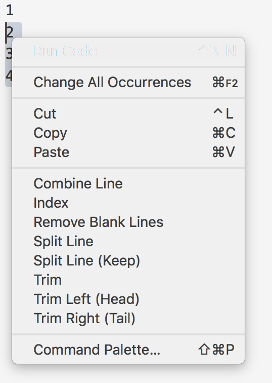

# edlin README
This extension will help to edit line, so it is edlin.

MENTION: `only work while select something`.

## Usage
- `Select` the text / line at first.
- `Click right button` to choose the function in menu;
- Or use `Command Pallete` (some only work here, e.g. `Index From`).
- `Choose the function` you wanna!
- Some comman

## Features
### Edit
- `Trim` the selected lines
    - left, right or both sides
- `Remove blank` lines in selection
- `Split` current line by the selected word (as splitor)
    - keep the splitor (**a,b => a\nb**)
    - or not (**a,b => a,\nb**)
- `Combine` (`join`) selected lines
    - join (**a\nb => ab**)
    - join with specific string (**a\nb => a,b**)
- `Wrap` the selected lines:
    - use **$1** as original like regex
- `Index` the selected lines:
    - **only allow number index and in format: "1. "**
    - can index from a given number (only numbers)
- Auto adapt `Windows/MacOS/Unix`
    - \r, \n, \r\n
- `No sort`
    - **vscode build-in**
### Menu
- Context menu for all edline function above.

## Known Issues
* [0.2.0] (fixed) Some functions not work in some systems (e.g.MacOS)
* [0.1.0] (fixed) MacOS can not use the trim function.
* [0.0.2] (fixed) Can not remove blank line in some file. It comes from the wrong splitor.

## Release Notes
May see the catalog for details.
* [0.5.0] Add wrap(using $1 like regex).
* [0.4.0] Add Index(from), Combine(With).
* [0.3.0] Add command category for convenience; Add a simple index function.
* [0.2.0] Update the support of Windows, Unix, and MacOS.
* [0.1.0] Support Windows, Unix, and MacOS now.
* [0.0.3] All features completed.
* [0.0.1] Initial release of edlin.

## Misc
Source code in [Github](https://github.com/FFengIll/vscode-edlin)
under [MIT Lisence](https://mit-license.org/).

Thanks to 
[上位者的怜悯](http://www.cnblogs.com/lianmin/p/5499266.html)
[rintoj](https://github.com/rintoj/blank-line-organizer)

**Enjoy!**